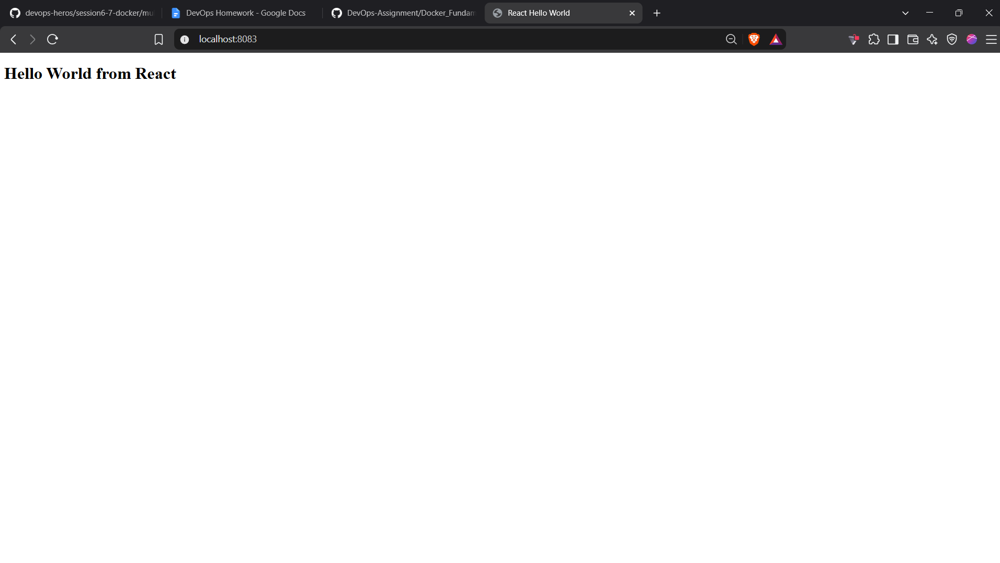

# Docker Hello World Applications


This folder contains six independent Docker applications for the Docker homework:

| Application | Folder | Host port | Container port |
| --- | --- | ---: | ---: |
| Node.js | `nodejs-app` | 3001 | 3000 |
| Python | `python-app` | 8001 | 8000 |
| Java | `java-app` | 8081 | 8080 |
| Apache | `apache-app` | 8082 | 80 |
| React | `react-app` | 8083 | 80 |
| Nginx | `nginx-app` | 8084 | 80 |

## Build

Run from this folder:

```powershell
docker build -t hello-node ./nodejs-app
docker build -t hello-python ./python-app
docker build -t hello-java ./java-app
docker build -t hello-apache ./apache-app
docker build -t hello-react ./react-app
docker build -t hello-nginx ./nginx-app
```

## Run

```powershell
docker rm -f hello-node hello-python hello-java hello-apache hello-react hello-nginx 2>$null
docker run -d --name hello-node -p 3001:3000 hello-node
docker run -d --name hello-python -p 8001:8000 hello-python
docker run -d --name hello-java -p 8081:8080 hello-java
docker run -d --name hello-apache -p 8082:80 hello-apache
docker run -d --name hello-react -p 8083:80 hello-react
docker run -d --name hello-nginx -p 8084:80 hello-nginx
```

## Verify

```powershell
docker ps --format "table {{.Names}}\t{{.Status}}\t{{.Ports}}"
$urls = 'http://localhost:3001','http://localhost:8001','http://localhost:8081','http://localhost:8082','http://localhost:8083','http://localhost:8084'
$urls | ForEach-Object { (Invoke-WebRequest $_).Content }
```

Expected headings: `Hello World from Node.js`, `Hello World from Python`, `Hello World from Java`, `Hello World from Apache`, `Hello World from React`, and `Hello World from Nginx`.

Browser verification URLs:

```text
http://localhost:3001
http://localhost:8001
http://localhost:8081
http://localhost:8082
http://localhost:8083
http://localhost:8084
```

## GitHub submission

From the repository root, replace the placeholder with your own repository URL:

```powershell
git init
git add "DEV-OPS Himanshu/Docker Fundamentals"
git commit -m "Add Docker Hello World applications"
git branch -M main
git remote add origin <YOUR_GITHUB_REPOSITORY_URL>
git push -u origin main
```

Do not commit passwords or access tokens.

## Cleanup

```powershell
docker rm -f hello-node hello-python hello-java hello-apache hello-react hello-nginx
```

