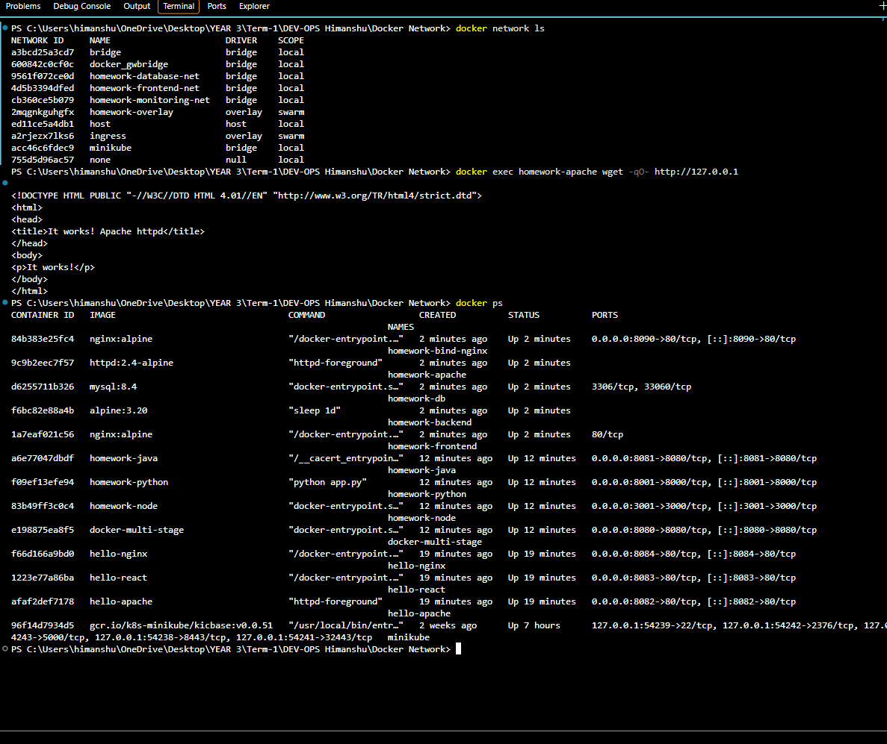
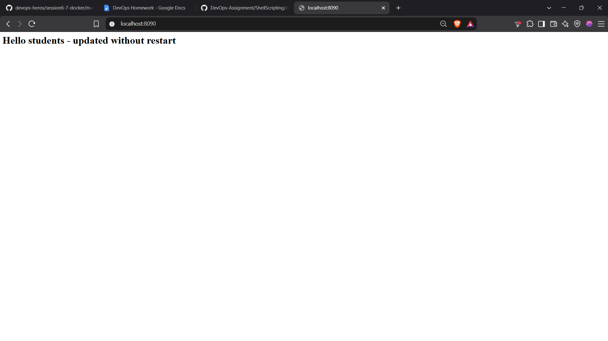

# Docker Networking and Volume Homework


Name: `HIMANSHU CHAUHAN`  
Enrollment number: `24BCS10071`


## Prerequisites

- Docker Desktop is installed and running.
- Run PowerShell from this directory.

## Task 1: Container networking

The lab creates three bridge networks:

| Network | Containers |
| --- | --- |
| `homework-frontend-net` | `homework-frontend`, `homework-backend` |
| `homework-database-net` | `homework-backend`, `homework-db` |
| `homework-monitoring-net` | reserved third lab network |

The backend is attached to exactly two networks: `homework-frontend-net` and `homework-database-net`. The database uses the MySQL image; the frontend uses Nginx; the backend uses Alpine.

Run:

```powershell
.\run-lab.ps1
```

Connectivity checks used by the script:

```powershell
docker exec homework-frontend getent hosts homework-backend
docker exec homework-backend getent hosts homework-db
docker inspect homework-backend --format '{{range $name, $network := .NetworkSettings.Networks}}{{$name}} {{end}}'
```

These checks confirm container-to-container DNS connectivity and backend membership in two networks.

## Task 2: Host network

The script pulls and runs Apache with Docker's host network:

```powershell
docker run -d --name homework-apache --network host httpd:2.4-alpine
(Invoke-WebRequest -UseBasicParsing http://localhost).StatusCode
```

On a native Linux Docker host, open `http://localhost` in a browser; Apache is directly on port `80`. In this Docker Desktop for Windows environment, host networking is inside the Linux VM and is not forwarded to the Windows browser, so the equivalent verification is:

```powershell
docker exec homework-apache httpd -t
docker exec homework-apache wget -qO- http://127.0.0.1
```

The first command returns `Syntax OK`; the second returns the Apache `It works!` page from port `80` inside the host-network container.

## Task 3: Bind mount

The local file `bind-mount/index.html` is mounted read-only into Nginx:

```powershell
docker run -d --name homework-bind-nginx -p 8090:80 -v "${PWD}\bind-mount:/usr/share/nginx/html:ro" nginx:alpine
(Invoke-WebRequest -UseBasicParsing http://localhost:8090).Content
```

Edit `bind-mount/index.html` and replace the content with:

```html
<h1>Hello students - updated without restart</h1>
```

Verify without restarting the container:

```powershell
(Invoke-WebRequest -UseBasicParsing http://localhost:8090).Content
docker ps --filter "name=homework-bind-nginx"
```

## Task 4: Overlay network

An overlay network connects Docker containers across Docker Engine hosts. In a Swarm, the control plane distributes the network definition and a VXLAN-based data plane carries container traffic between hosts. Services attach to the overlay network by name and can communicate across nodes.

Create the single-node demonstration:

```powershell
docker swarm init
docker network create --driver overlay homework-overlay
docker network inspect homework-overlay
```

For multiple Docker hosts, initialize one manager with `docker swarm init --advertise-addr <MANAGER_IP>`, join workers using the generated `docker swarm join` command, and create the overlay network on the manager. `<MANAGER_IP>` and the join token are environment-specific values and are intentionally not included here.

## Evidence

Add the final screenshots supplied for submission here:





The first screenshot shows the three networks, the Apache host-network response, and `docker ps`. The second shows the updated bind-mounted page on `http://localhost:8090`. The README commands above provide the separate DNS connectivity checks and explain the Docker Desktop host-network browser limitation.

## Cleanup

```powershell
docker rm -f homework-frontend homework-backend homework-db homework-apache homework-bind-nginx
docker network rm homework-frontend-net homework-database-net homework-monitoring-net homework-overlay
docker swarm leave --force
```
