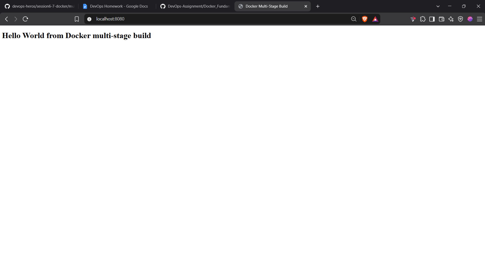
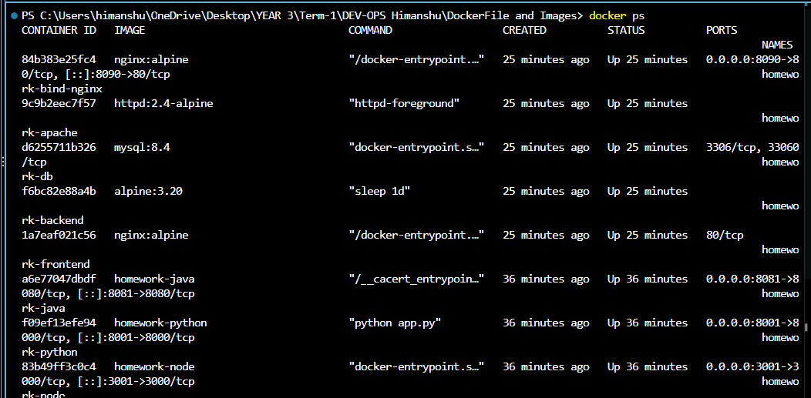

# Docker Multi-Stage Build Homework

Name: `HIMANSHU CHAUHAN`  
Enrollment number: `24BCS10071`

## Task 1: Multi-stage Dockerfile

The `multi-stage-app` directory is the corrected version of the multi-stage example from the supplied `devops-heros/session6-7-docker/multi-stage-dockerfile` source. It serves the required message on container port `8080`.

Run from this directory:

```powershell
docker build -t docker-multi-stage ./multi-stage-app
docker rm -f docker-multi-stage 2>$null
docker run -d --name docker-multi-stage -p 8080:8080 docker-multi-stage
docker ps --filter "name=docker-multi-stage"
(Invoke-WebRequest -UseBasicParsing http://localhost:8080).Content
```

Expected output contains:

```text
Hello World from Docker multi-stage build
```

Open `http://localhost:8080` in a browser to verify the webpage.

## Task 3: Three Docker applications

Build and run the Node.js, Python, and Java applications:

```powershell
docker build -t homework-node ./node-app
docker build -t homework-python ./python-app
docker build -t homework-java ./java-app
docker rm -f homework-node homework-python homework-java 2>$null
docker run -d --name homework-node -p 3001:3000 homework-node
docker run -d --name homework-python -p 8001:8000 homework-python
docker run -d --name homework-java -p 8081:8080 homework-java
docker ps --filter "name=homework-"
```

Verify all responses:

```powershell
(Invoke-WebRequest -UseBasicParsing http://localhost:3001).Content
(Invoke-WebRequest -UseBasicParsing http://localhost:8001).Content
(Invoke-WebRequest -UseBasicParsing http://localhost:8081).Content
```

## Evidence

Browser evidence supplied for submission:





The screenshot shows the browser page at `http://localhost:8080` displaying the required message.

Verified `docker ps` output:

```text
NAMES                STATUS       PORTS
docker-multi-stage   Up           0.0.0.0:8080->8080/tcp
homework-java        Up           0.0.0.0:8081->8080/tcp
homework-python      Up           0.0.0.0:8001->8000/tcp
homework-node        Up           0.0.0.0:3001->3000/tcp
```

## GitHub upload

From the repository root, replace the placeholder with your own repository URL:

```powershell
git add "DEV-OPS Himanshu/DockerFile and Images"
git commit -m "Add multi-stage Docker homework"
git push origin main
```

Do not commit passwords or access tokens.

## Cleanup

```powershell
docker rm -f docker-multi-stage homework-node homework-python homework-java
```