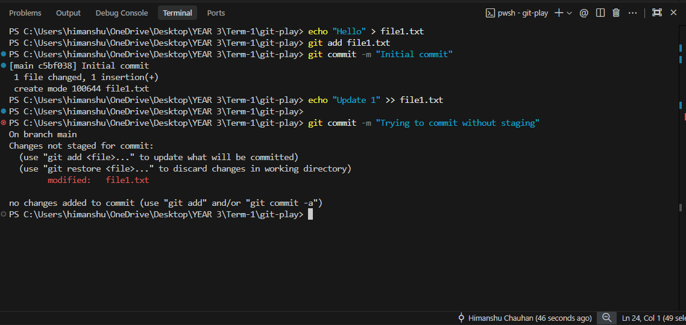
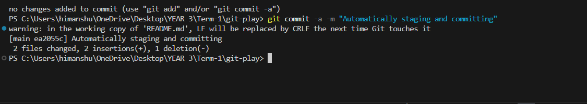
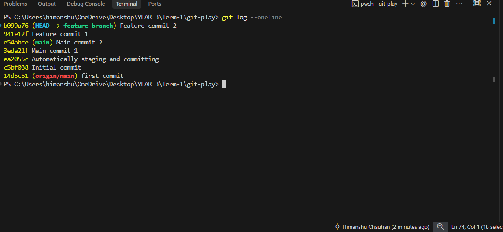
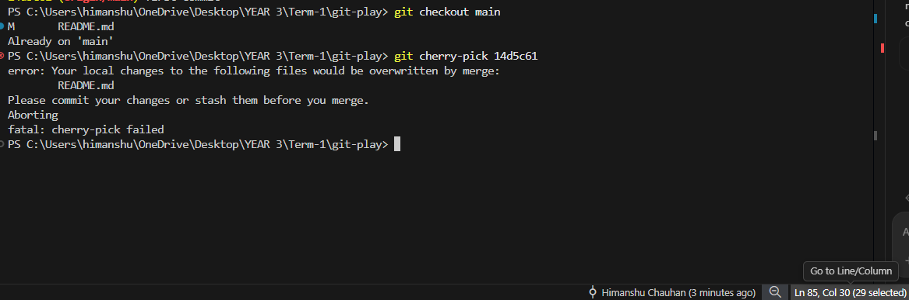
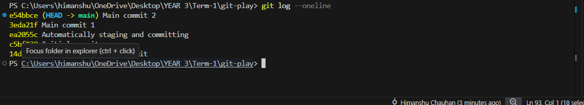

# Git Homework Tasks

## Task 1: `git commit -a -m` vs `git commit -m`

### The Difference
* **`git commit -m "message"`**: Commits only the changes that have been explicitly staged using `git add`. It will *not* commit modified files that haven't been staged.
* **`git commit -a -m "message"`**: Automatically stages any modified or deleted files that are *already tracked* by Git, and commits them in one step. (Note: It does *not* stage completely new, untracked files).

### Practice Commands
Run these commands in your terminal to observe the difference:

1. **Initialize and setup test files:**
```bash
git init
echo "Hello" > file1.txt
git add file1.txt
git commit -m "Initial commit"
```

2. **Modify the file and test `git commit -m`:**
```bash
echo "Update 1" >> file1.txt
git commit -m "Trying to commit without staging"
```
📸 ***(Take a screenshot here showing that Git refuses to commit because changes are not staged for commit)***


3. **Test `git commit -a -m`:**
```bash
git commit -a -m "Automatically staging and committing"
```
📸 ***(Take a screenshot here showing the successful commit)***



---


## Task 2: Git Cherry-Pick

### Practice Commands
Run these commands in your terminal to practice cherry-picking:

1. **Create commits in the `main` branch:**
```bash
echo "Main change 1" > main.txt
git add main.txt
git commit -m "Main commit 1"

echo "Main change 2" >> main.txt
git add main.txt
git commit -m "Main commit 2"
```

2. **Create and switch to a new branch:**
```bash
git checkout -b feature-branch
```

3. **Make commits in the new branch:**
```bash
echo "Feature change 1" > feature.txt
git add feature.txt
git commit -m "Feature commit 1"

echo "Feature change 2" >> feature.txt
git add feature.txt
git commit -m "Feature commit 2"
```

4. **Identify the specific commit to cherry-pick:**
```bash
git log --oneline
```
📸 ***(Take a screenshot here of the git log output showing your commit history. Find the 7-character hash for "Feature commit 1" and copy it!)***


5. **Cherry-pick the commit into main:**
First, switch back to the main branch:
```bash
git checkout main
```
Now, replace `<commit-hash>` in the command below with the hash you copied from the log:
```bash
git cherry-pick <commit-hash>
```
📸 ***(Take a screenshot here showing the successful cherry-pick output in the terminal)***


6. **Verify the change in the main branch:**
```bash
git log --oneline
```
📸 ***(Take a final screenshot showing the "Feature commit 1" successfully added to the `main` branch history)***

