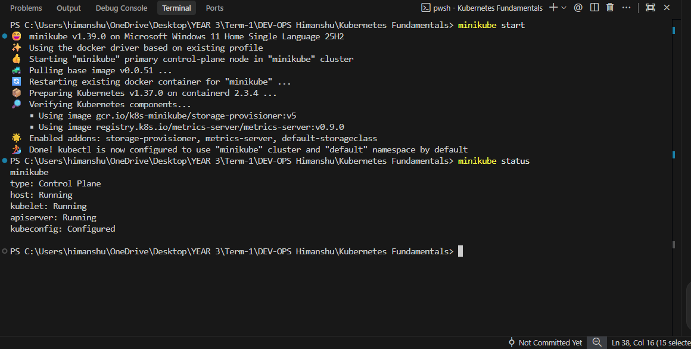
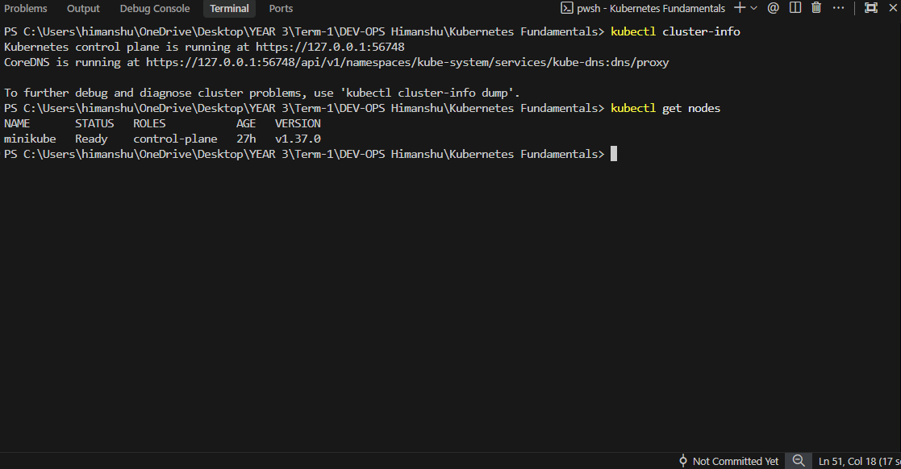
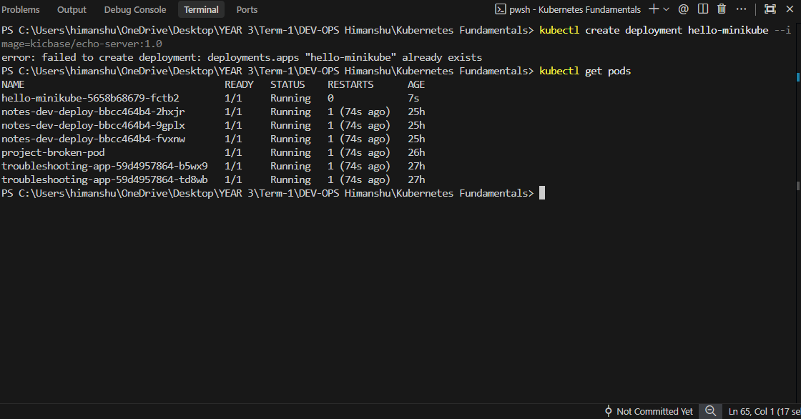
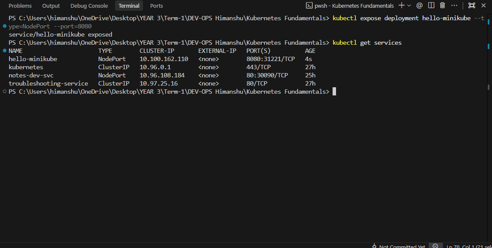
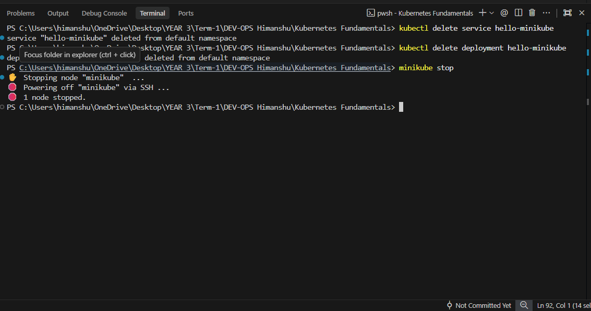

# Kubernetes Fundamentals

## 1. Kubernetes Architecture (Short Notes)
Kubernetes (K8s) is a distributed system that manages containerized applications across a cluster of machines. The architecture is split into two main parts:

### The Control Plane (Master Node)
The Control Plane is the brain of the cluster. It makes global decisions (like scheduling) and detects/responds to cluster events.
* **kube-apiserver:** The front-end of the control plane. All communication goes through here.
* **etcd:** A highly-available key-value store that holds all cluster data and state.
* **kube-scheduler:** Watches for newly created Pods with no assigned node, and selects a node for them to run on.
* **kube-controller-manager:** Runs controller processes (like node controller, replication controller) to logically regulate the state of the cluster.

### The Worker Nodes
These are the machines where your actual application containers run.
* **kubelet:** An agent that runs on each node. It ensures that containers are running in a Pod according to the instructions from the control plane.
* **kube-proxy:** A network proxy that runs on each node, maintaining network rules to allow communication to your Pods.
* **Container Runtime:** The software that is responsible for running containers (e.g., Docker, containerd).

---

## 2. Basic Kubernetes Objects
* **Pod:** The smallest and simplest Kubernetes object. It represents a single instance of a running process in your cluster (usually wrapping one container).
* **Deployment:** Provides declarative updates for Pods and ReplicaSets. It ensures the desired number of Pods are always running.
* **Service:** An abstraction that defines a logical set of Pods and a policy by which to access them (provides stable networking/IPs).

---

## 3. Hands-On: Minikube & Kubernetes Basics

Run the following commands in your terminal to complete the Kubernetes Basics tutorial.

### Step 1: Start and Verify Minikube
```bash
# Start your local Kubernetes cluster
minikube start

# Check the status of Minikube
minikube status
```
📸 ***(Take a screenshot here showing that Minikube is successfully running)***



### Step 2: Verify Kubernetes Cluster Status
```bash
# View the cluster information
kubectl cluster-info

# Check that your node is ready
kubectl get nodes
```
📸 ***(Take a screenshot here showing the output of cluster-info and your ready node)***



### Step 3: Create a Deployment (Run an App)
```bash
# Create a deployment using the echo-server image
kubectl create deployment hello-minikube --image=kicbase/echo-server:1.0

# Check that your Pod is running
kubectl get pods
```
📸 ***(Take a screenshot here showing your newly created Pod in a "Running" state)***



### Step 4: Expose the App (Create a Service)
```bash
# Expose the deployment on a specific port
kubectl expose deployment hello-minikube --type=NodePort --port=8080

# Check that the Service was created
kubectl get services
```
📸 ***(Take a screenshot here showing the Service details and its assigned ports)***



### Step 5: Clean Up
```bash
# Delete the service and deployment
kubectl delete service hello-minikube
kubectl delete deployment hello-minikube

# Stop the minikube cluster to save RAM
minikube stop
```

