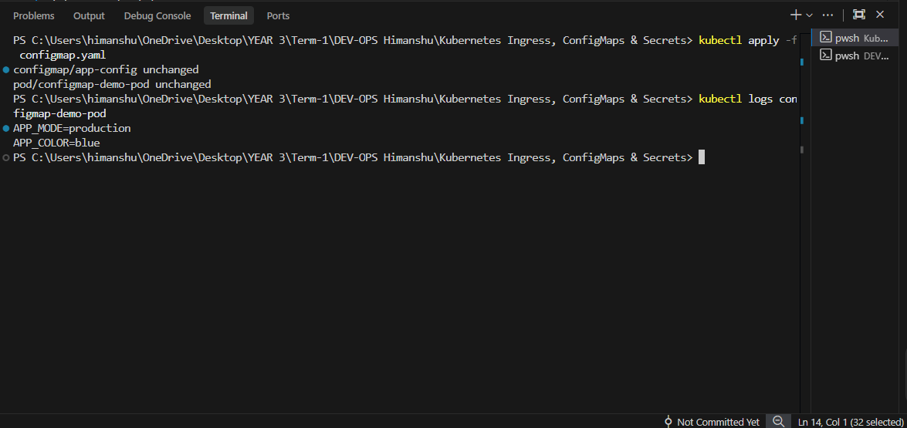
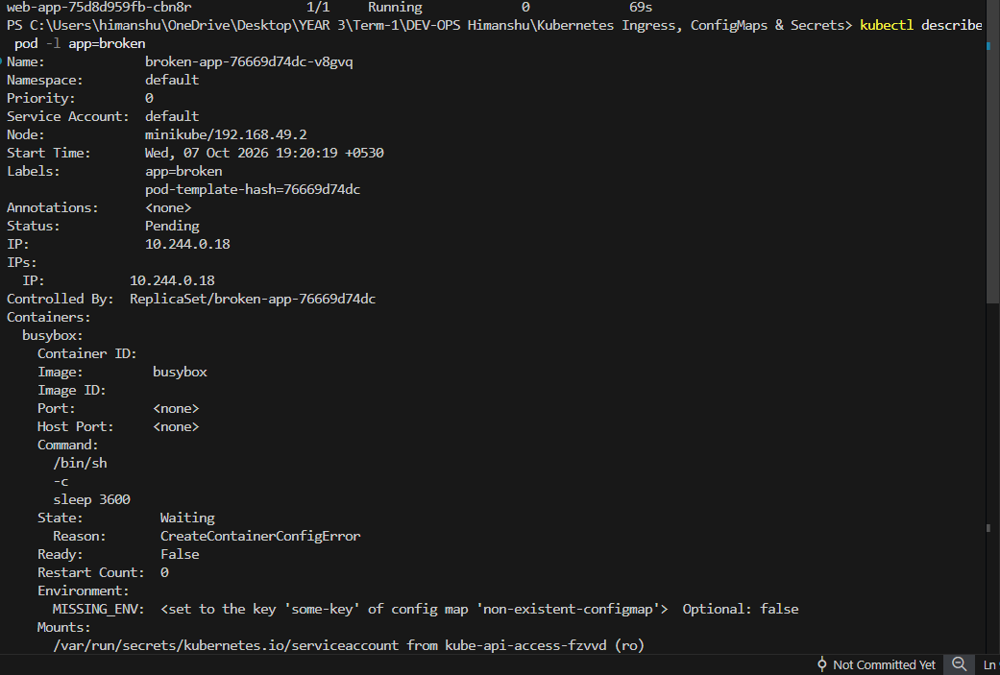
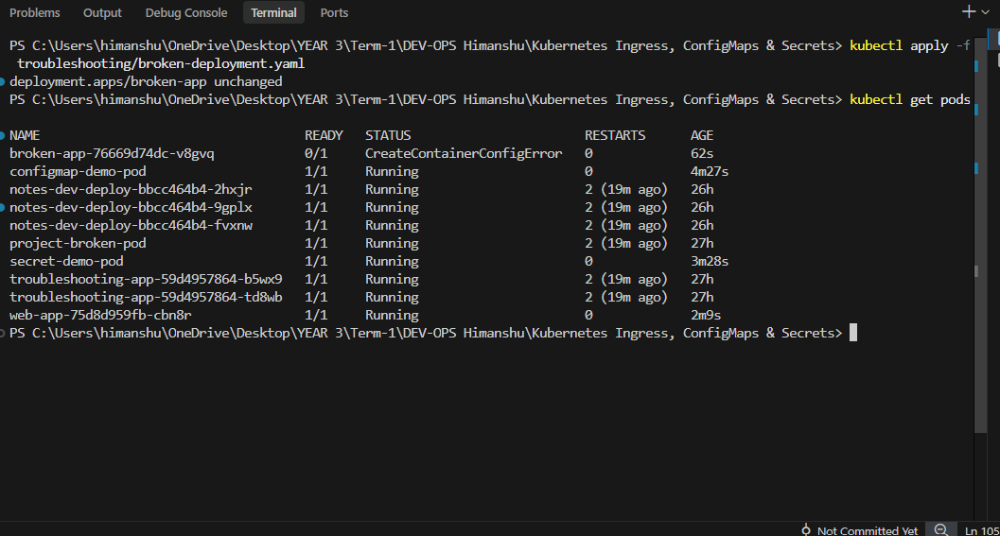
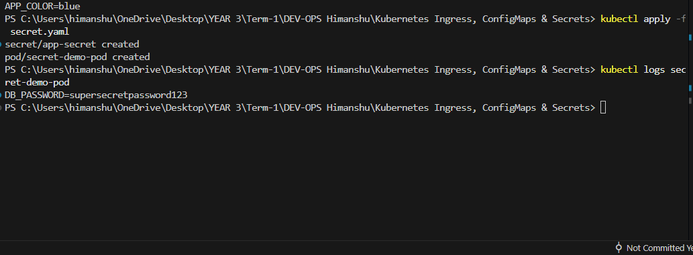
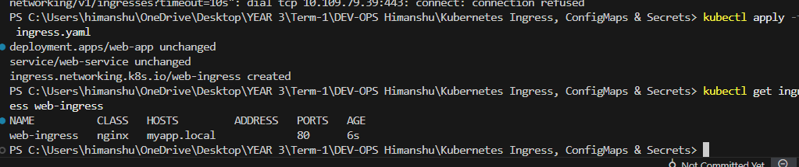

# Session 12: Kubernetes Ingress, ConfigMaps & Secrets

## Task 1: ConfigMap Demo
ConfigMaps are used to store non-confidential data in key-value pairs. 

**Steps:**
1. Apply the ConfigMap and the Pod:
```bash
kubectl apply -f configmap.yaml
```
2. Verify the configuration values were injected inside the container:
```bash
kubectl logs configmap-demo-pod
```
📸 ***(Take a screenshot showing `APP_COLOR=blue` and `APP_MODE=production` in the logs)***



---

## Task 2: Secret Demo
Secrets are similar to ConfigMaps but are specifically intended to hold confidential data like passwords, OAuth tokens, and ssh keys.

**Steps:**
1. Apply the Secret and the Pod:
```bash
kubectl apply -f secret.yaml
```
2. Verify the secret value was injected inside the container:
```bash
kubectl logs secret-demo-pod
```
📸 ***(Take a screenshot showing `DB_PASSWORD=supersecretpassword123` in the logs)***


### Why shouldn't Secrets be committed to Git?
Git repositories (especially public ones like GitHub) are accessible to many people and automated bots. If you commit a secret (like an AWS API key or Database password) in plain text, attackers can scrape it and compromise your infrastructure immediately. Secrets should be encrypted at rest (e.g. using SOPS, Hashicorp Vault, or AWS Secrets Manager) and never pushed directly to source control.

---

## Task 3: Ingress Demo
Ingress exposes HTTP and HTTPS routes from outside the cluster to services within the cluster. 

**Steps:**
1. First, you must enable the Ingress controller in Minikube:
```bash
minikube addons enable ingress
```
2. Deploy the application, service, and Ingress rule:
```bash
kubectl apply -f ingress.yaml
```
3. Wait a few moments, and check the Ingress routing:
```bash
kubectl get ingress web-ingress
```
📸 ***(Take a screenshot showing the Ingress resource created and routing rules)***


---

## Task 4: Ingress vs Ingress Controller

### What is Ingress?
Ingress is purely a **Kubernetes resource** (a YAML rule) that defines how external traffic should be routed to internal Services. It acts like a set of routing rules (e.g. "If traffic comes to `/api`, send it to the `api-service`"). 

### What is an Ingress Controller?
An Ingress Controller is the **actual running software/pod** (like NGINX, Traefik, or HAProxy) that reads those Ingress rules and executes them. 

### The Difference & Why both are required:
An Ingress resource by itself does absolutely nothing. It is just a configuration file. The Ingress Controller is the engine that constantly monitors the Kubernetes API for new Ingress rules and dynamically configures its internal proxy to route the traffic. You need **both**: the Controller (engine) and the Ingress (rules) to expose your apps!

---

## Task 5: Troubleshooting

We have a broken application inside the `troubleshooting/` folder. 

**Steps:**
1. Apply the broken deployment:
```bash
kubectl apply -f troubleshooting/broken-deployment.yaml
```
2. Check the status of the pod (You will notice it is failing):
```bash
kubectl get pods
```
3. **Run troubleshooting commands to find the root cause:**
```bash
# This command will tell us why the pod isn't starting
kubectl describe pod -l app=broken
```
📸 ***(Take a "Before" screenshot here showing the `CreateContainerConfigError` due to the missing ConfigMap)***



4. **Identify the Problem & Fix it:**
* **Root Cause:** The Pod is trying to load environment variables from a ConfigMap named `non-existent-configmap`, which doesn't exist in the cluster.
* **The Fix:** Open `troubleshooting/broken-deployment.yaml` in your editor. Change line 20 from `name: non-existent-configmap` to `name: app-config` (the ConfigMap we created in Task 1). Also change the `key:` on line 21 to `APP_COLOR`.

5. **Apply the fix and verify:**
```bash
kubectl apply -f troubleshooting/broken-deployment.yaml
kubectl get pods
```
📸 ***(Take an "After" screenshot here showing the pod is now successfully in a "Running" state)***



---
### Clean up:
```bash
kubectl delete -f configmap.yaml
kubectl delete -f secret.yaml
kubectl delete -f ingress.yaml
kubectl delete -f troubleshooting/broken-deployment.yaml
```
