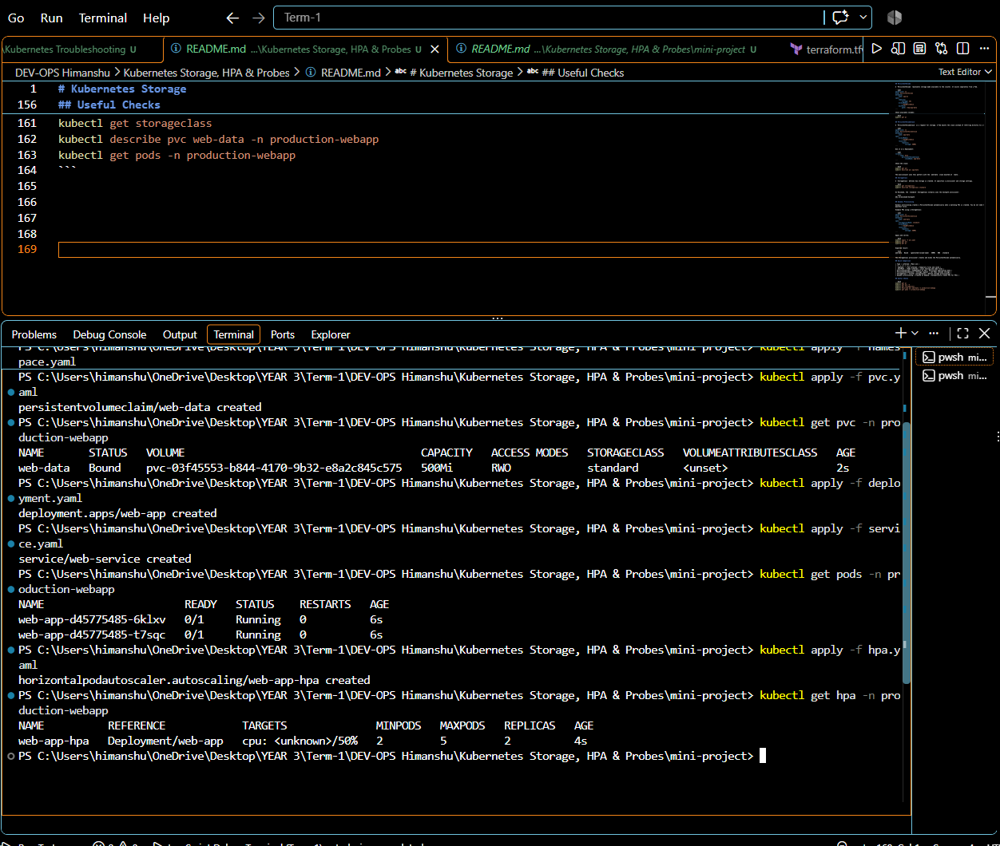
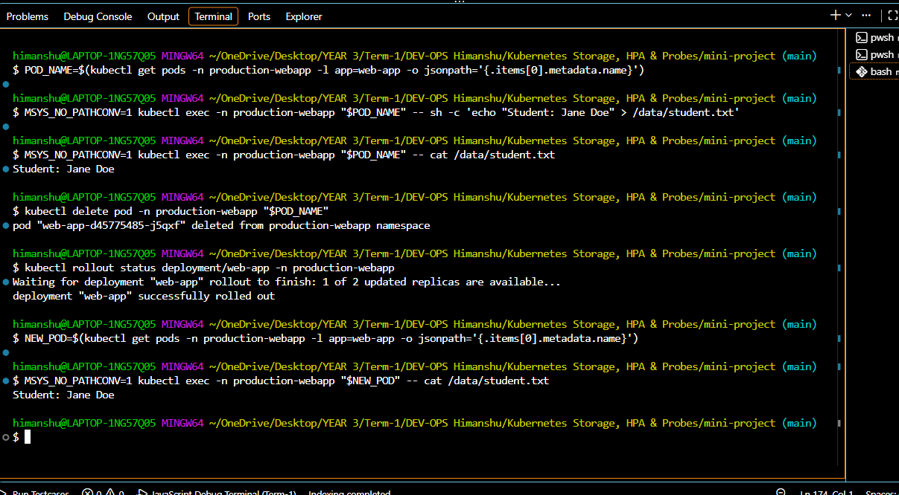
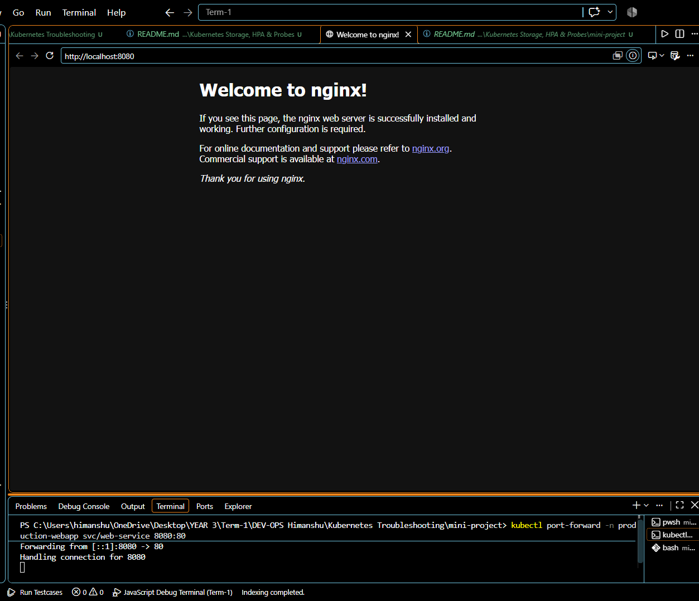
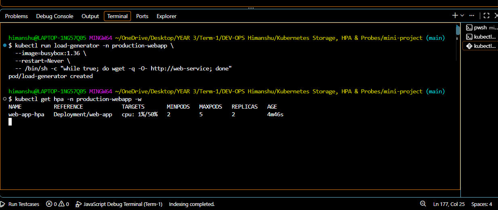
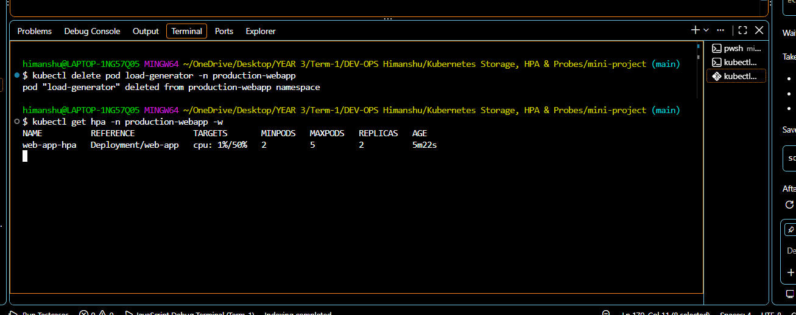

# Kubernetes Storage

## emptyDir

`emptyDir` creates temporary storage for containers in the same Pod. It is empty when the Pod starts and is deleted when the Pod is deleted. It is useful for cache files and sharing temporary files between containers.

```yaml
volumes:
	- name: cache
		emptyDir: {}
containers:
	- name: app
		image: nginx:1.27
		volumeMounts:
			- name: cache
				mountPath: /cache
```

Data survives a container restart, but not Pod deletion.

## hostPath

`hostPath` mounts a directory from the Kubernetes node into a Pod. It is useful for local testing, but it ties the Pod to the node and should be avoided for portable production workloads.

```yaml
volumes:
	- name: node-files
		hostPath:
			path: /var/lib/my-app
			type: DirectoryOrCreate
```

The directory belongs to the node, not to Kubernetes. If the Pod moves to another node, the data may not be there.

## PersistentVolume

A `PersistentVolume` represents storage made available to the cluster. It exists separately from a Pod.

```yaml
apiVersion: v1
kind: PersistentVolume
metadata:
	name: app-pv
spec:
	capacity:
		storage: 1Gi
	accessModes:
		- ReadWriteOnce
	hostPath:
		path: /tmp/app-data
```

Check available volumes:

```bash
kubectl get pv
```

## PersistentVolumeClaim

A `PersistentVolumeClaim` is a request for storage. A Pod mounts the claim instead of referring directly to a volume.

```yaml
apiVersion: v1
kind: PersistentVolumeClaim
metadata:
	name: app-data
spec:
	accessModes:
		- ReadWriteOnce
	resources:
		requests:
			storage: 500Mi
```

Use it in a Deployment:

```yaml
volumes:
	- name: data
		persistentVolumeClaim:
			claimName: app-data
```

Check the claim:

```bash
kubectl get pvc
kubectl describe pvc app-data
```

The mini-project uses this pattern with the `web-data` claim mounted at `/data`.

## StorageClass

A `StorageClass` defines how storage is created. It specifies a provisioner and storage settings.

```bash
kubectl get storageclass
kubectl describe storageclass standard
```

On Minikube, the `standard` StorageClass normally uses the hostpath provisioner:

```text
k8s.io/minikube-hostpath
```

## Dynamic Provisioning

Dynamic provisioning creates a PersistentVolume automatically when a matching PVC is created. You do not need to write a PV manifest first.

Example PVC using a StorageClass:

```yaml
apiVersion: v1
kind: PersistentVolumeClaim
metadata:
	name: web-data
spec:
	storageClassName: standard
	accessModes:
		- ReadWriteOnce
	resources:
		requests:
			storage: 500Mi
```

Apply and verify:

```bash
kubectl apply -f pvc.yaml
kubectl get pvc
kubectl get pv
```

Expected result:

```text
web-data   Bound   <generated-volume-name>   500Mi   RWO   standard
```

The StorageClass provisioner creates and binds the PersistentVolume automatically.

## Quick Comparison

| Type | Lifetime | Main use |
| --- | --- | --- |
| `emptyDir` | Pod lifetime | Temporary files and cache |
| `hostPath` | Node lifetime | Local testing and node files |
| PersistentVolume | Independent of Pod | Persistent application data |
| PersistentVolumeClaim | Storage request | Let Pods consume storage |
| StorageClass | Cluster configuration | Define storage provisioning |
| Dynamic provisioning | Created on demand | Automatically create PVs for PVCs |

## Useful Checks

```bash
kubectl get pv
kubectl get pvc -A
kubectl get storageclass
kubectl describe pvc web-data -n production-webapp
kubectl get pods -n production-webapp
```


mini project screenshots 












