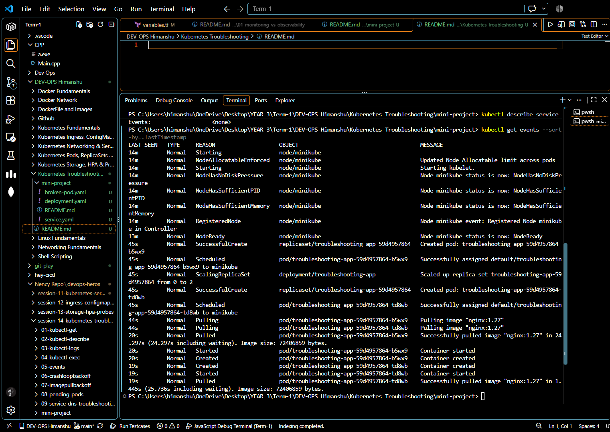
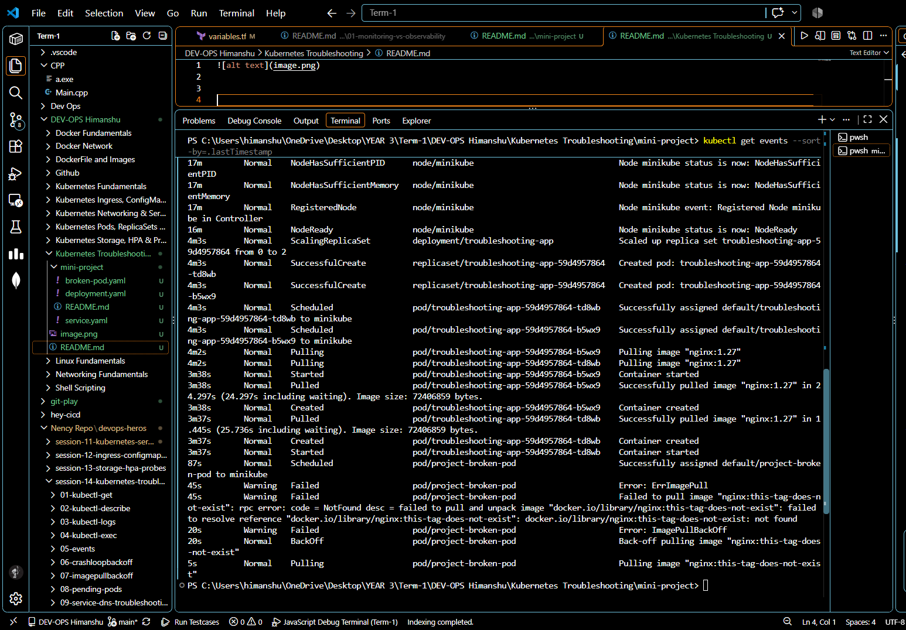
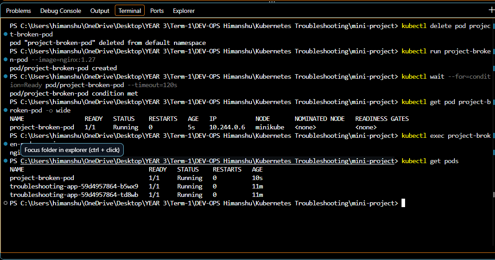
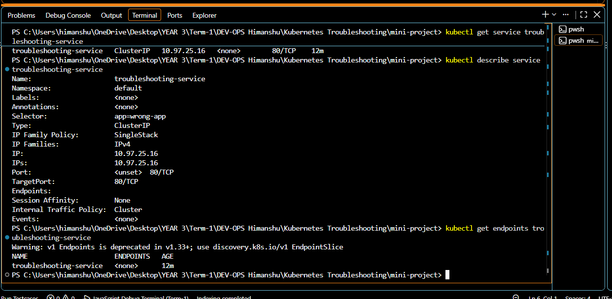

## Kubernetes Troubleshooting

### CrashLoopBackOff

- **Problem:** The container starts and then stops repeatedly.
- **Investigation:** `kubectl get pods`, `kubectl describe pod <pod>`, `kubectl logs <pod>`.
- **Root cause:** The application command, configuration, or dependency is failing.
- **Fix:** Correct the command or configuration, then redeploy.
- **Verify:** `kubectl get pods` shows `Running` and the logs show normal startup.

### ImagePullBackOff / ErrImagePull

- **Problem:** Kubernetes cannot download the container image.
- **Investigation:** `kubectl describe pod <pod>` and check Events.
- **Root cause:** Wrong image name or tag, a private registry, or missing registry access.
- **Fix:** Use a valid image tag or add the required image pull secret.
- **Verify:** `kubectl get pod <pod>` shows `Running`.

```powershell
kubectl describe pod <pod>
kubectl get events --sort-by=.lastTimestamp
```

### Pending

- **Problem:** The Pod is not scheduled to a node.
- **Investigation:** `kubectl describe pod <pod>` and read Events.
- **Root cause:** Not enough resources, an invalid node selector, taints, or unavailable storage.
- **Fix:** Free resources or correct the scheduling and storage settings.
- **Verify:** The Pod changes to `Running`.

### ContainerCreating

- **Problem:** The Pod is scheduled but the container is not ready.
- **Investigation:** `kubectl describe pod <pod>` and `kubectl get events`.
- **Root cause:** Image download, volume mount, networking, or secret setup is still failing.
- **Fix:** Correct the reported image, volume, secret, or network problem.
- **Verify:** The container becomes `Ready`.

### Service Connectivity

- **Problem:** The Service cannot reach the application.
- **Investigation:** Check the Service, Pod labels, target port, and endpoints.
- **Root cause:** The selector does not match the Pod labels, or `targetPort` is wrong.
- **Fix:** Make the selector and Pod labels match and use the correct container port.
- **Verify:** `kubectl get endpoints <service>` shows Pod IP addresses.

```powershell
kubectl get svc <service>
kubectl describe svc <service>
kubectl get endpoints <service>
kubectl get pods --show-labels
```

### DNS Issues

- **Problem:** A Pod cannot resolve a Service name.
- **Investigation:** Check CoreDNS and test from inside a Pod.
- **Root cause:** Wrong Service name, namespace, or a CoreDNS problem.
- **Fix:** Use the correct Service DNS name and restart or repair CoreDNS if needed.
- **Verify:** `nslookup <service>.<namespace>.svc.cluster.local` returns an address.

```powershell
kubectl get pods -n kube-system -l k8s-app=kube-dns
kubectl exec <pod> -- nslookup <service>.<namespace>.svc.cluster.local
```

### Pod Networking

- **Problem:** Pods cannot communicate with each other.
- **Investigation:** Check Pod IPs, network policies, and connectivity from a test Pod.
- **Root cause:** A network policy, CNI problem, or wrong destination port.
- **Fix:** Correct the policy or CNI configuration and use the correct port.
- **Verify:** A request from one Pod to another succeeds.

```powershell
kubectl get pods -o wide
kubectl get networkpolicy
kubectl exec <client-pod> -- curl -v http://<pod-ip>:<port>
```

### Configuration Issues

- **Problem:** The container starts with the wrong settings or fails at startup.
- **Investigation:** Check ConfigMaps, Secrets, environment variables, and mounted files.
- **Root cause:** A missing key, incorrect value, or wrongly mounted configuration file.
- **Fix:** Correct the ConfigMap, Secret, or Deployment reference and restart the Pods.
- **Verify:** `kubectl describe pod <pod>` and `kubectl logs <pod>` show the expected settings.

```powershell
kubectl get configmap
kubectl get secret
kubectl describe pod <pod>
kubectl logs <pod>
```