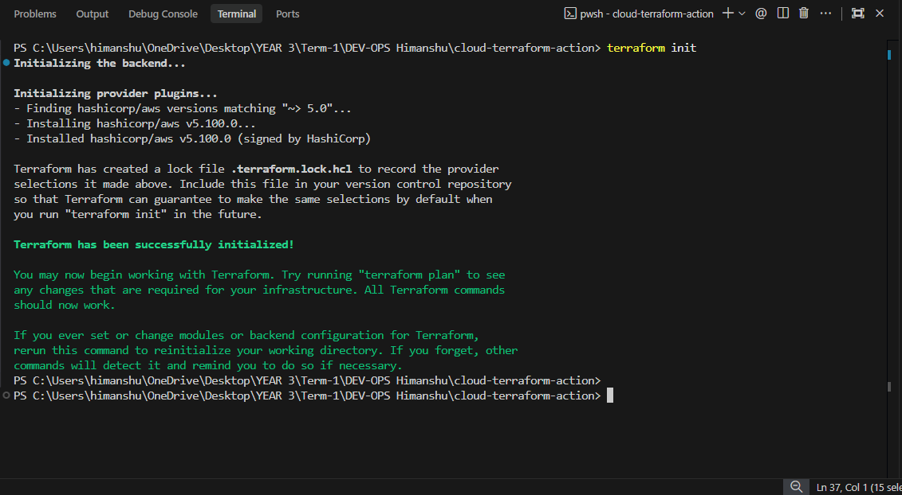
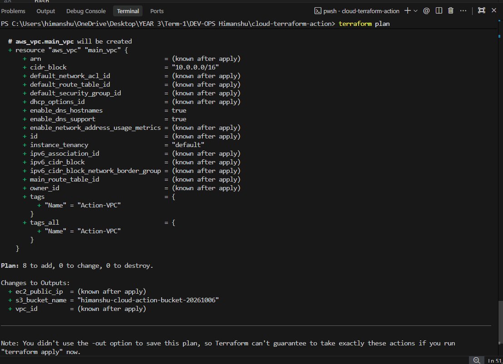
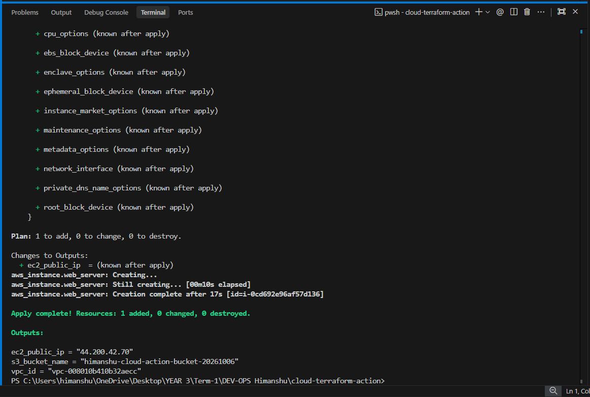
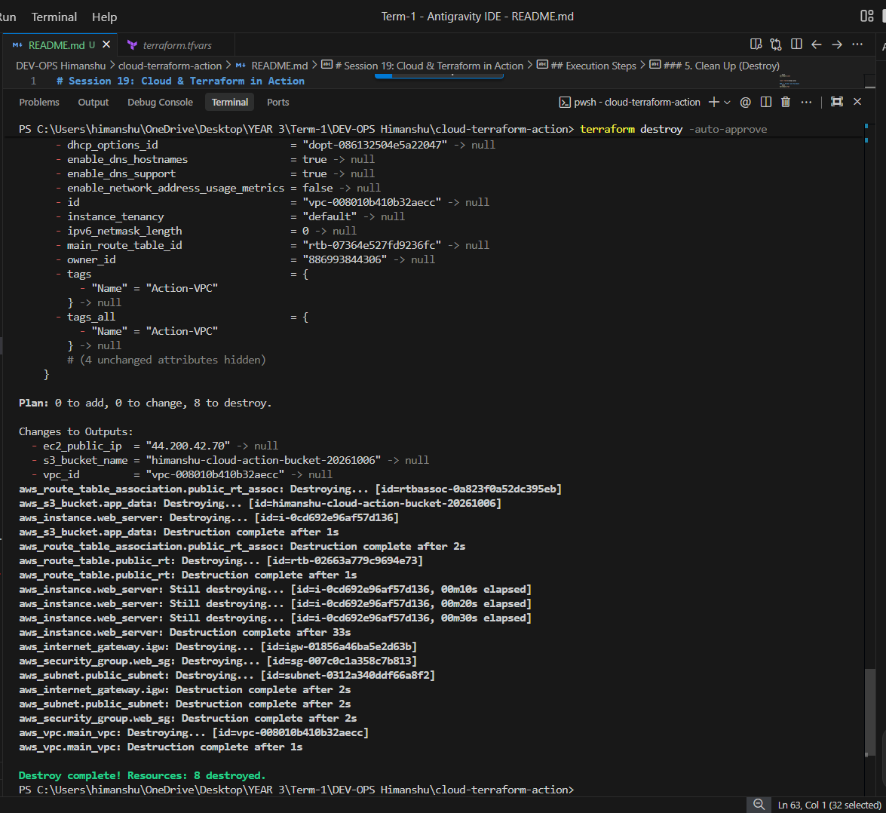

# Session 19: Cloud & Terraform in Action

This project is an end-to-end cloud infrastructure deployment using Terraform. It provisions a foundational AWS architecture including a VPC, Subnet, Security Group, EC2 instance, and an S3 bucket.

## Architecture Diagram

```mermaid
graph TD
    subgraph AWS Cloud
        S3[S3 Bucket]
        subgraph VPC [VPC CIDR: 10.0.0.0/16]
            IGW[Internet Gateway]
            subgraph Public Subnet [Subnet CIDR: 10.0.1.0/24]
                SG[Security Group: Port 22, 80]
                EC2[EC2 Instance t2.micro]
            end
        end
    end
    
    Internet((Internet)) --> IGW
    IGW --> Public Subnet
    SG --- EC2
```

## Terraform Concepts Demonstrated
* **Providers:** AWS Provider configured in `provider.tf`.
* **Variables:** Parameterized configurations in `variables.tf` and `terraform.tfvars`.
* **Resources:** VPC, Subnets, Route Tables, IGW, Security Groups, EC2, S3.
* **Outputs:** Extracting EC2 Public IP and S3 Bucket name (`outputs.tf`).
* **Dependencies:** Implicit dependencies (e.g., Subnet requires VPC) and Explicit dependencies (`depends_on` used for EC2 waiting on IGW).

## Execution Steps

### 1. Initialize Terraform
```bash
terraform init
```



### 2. Format and Validate
```bash
terraform fmt
terraform validate
```

### 3. Generate Execution Plan
```bash
terraform plan
```


### 4. Apply Infrastructure
```bash
terraform apply -auto-approve
```



### 5. Clean Up (Destroy)
```bash
terraform destroy -auto-approve
```
