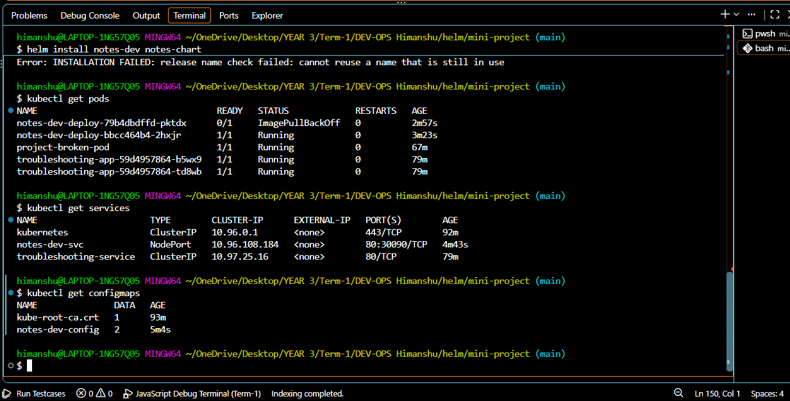
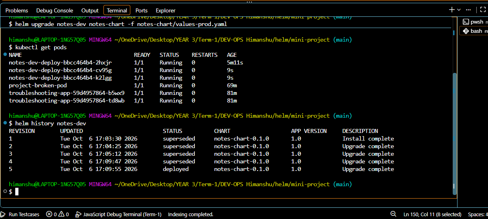
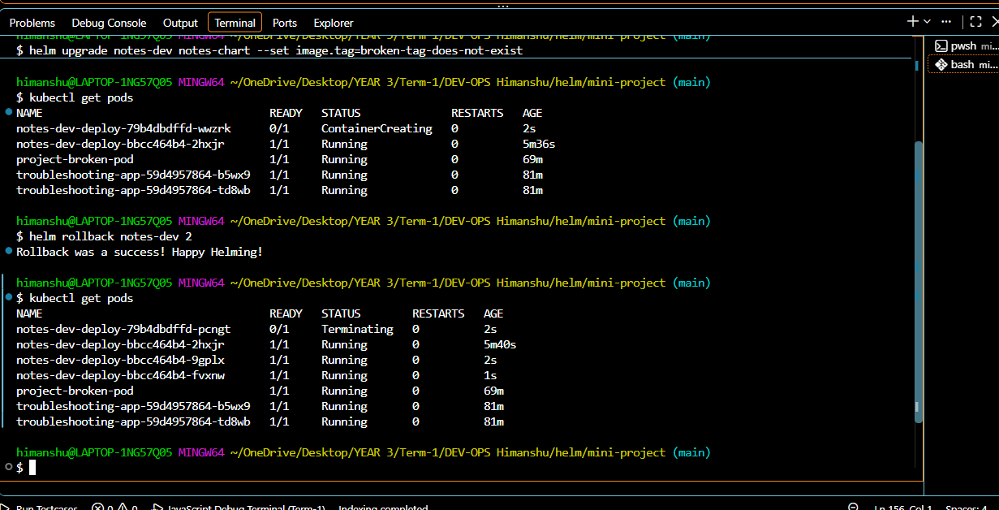

# Helm Command Practice

Run these commands from this folder.

## Create a Chart

```bash
helm create hello-chart
```

Creates a starter Helm chart with templates and default values.

## Install

```bash
helm install hello-release ./hello-chart
```

Installs the chart as `hello-release`.

## List Releases

```bash
helm list
```

Shows installed releases.

## Check Status

```bash
helm status hello-release
```

Shows the release status and deployed resources.

## Get Release Details

```bash
helm get all hello-release
```

Shows the release manifest, values, hooks, and notes.

## Upgrade

```bash
helm upgrade hello-release ./hello-chart
```

Updates the installed release with the chart changes.

## View History

```bash
helm history hello-release
```

Shows all revisions of the release.

## Rollback

```bash
helm rollback hello-release 1
```

Returns the release to revision 1.

## Uninstall

```bash
helm uninstall hello-release
```

Removes the release and its Kubernetes resources.

## Repositories

```bash
helm repo add bitnami https://charts.bitnami.com/bitnami
helm repo list
helm repo update
```

Adds a chart repository, lists repositories, and refreshes repository indexes.

## Search

```bash
helm search repo nginx
helm search hub nginx
```

Searches configured repositories and Artifact Hub.

## Complete Rollback Workflow

### 1. Install

```bash
helm install hello-release ./hello-chart
```

### 2. Upgrade

```bash
helm upgrade hello-release ./hello-chart
```

### 3. Verify

```bash
helm status hello-release
helm list
```

### 4. Upgrade Again

```bash
helm upgrade hello-release ./hello-chart
```

### 5. Verify Again

```bash
helm status hello-release
helm history hello-release
```

### 6. Rollback

```bash
helm rollback hello-release 1
```

### 7. Final Verification

```bash
helm status hello-release
helm history hello-release
```

The final status should show the release is deployed, and the history should show the rollback revision.


mini project 









