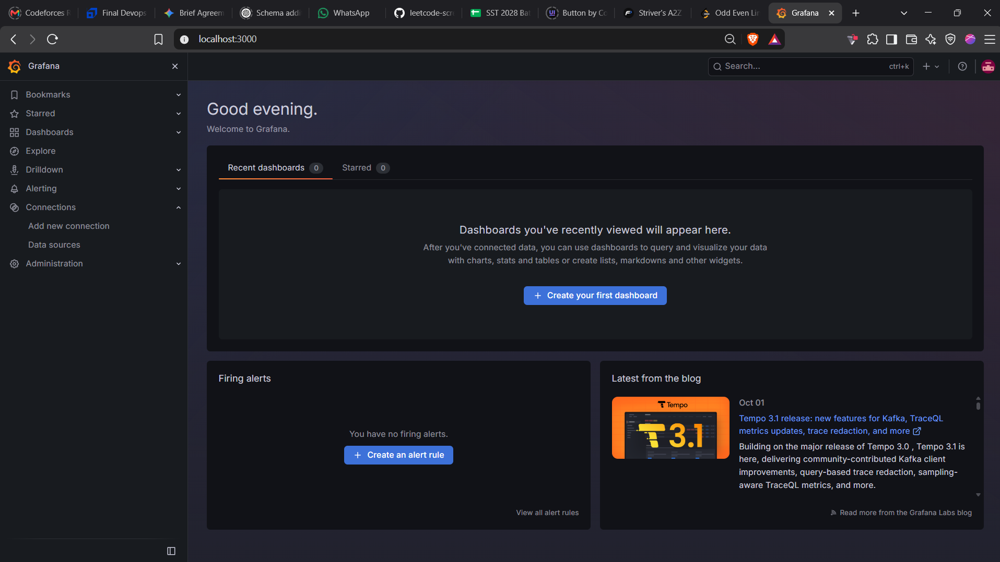
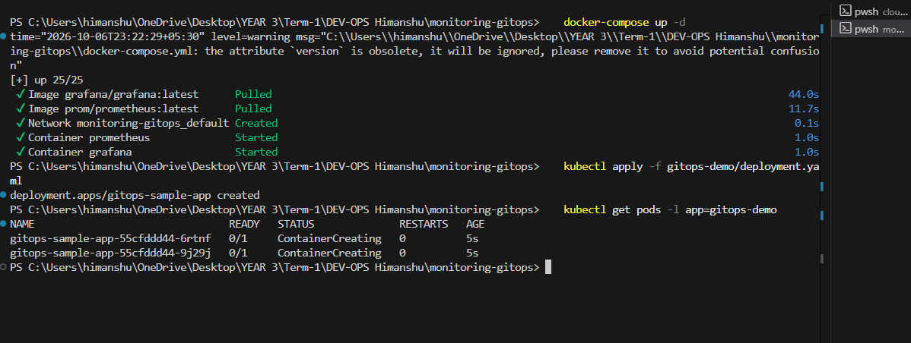

# Session 20: Monitoring, Observability & GitOps

## Task 1: Monitoring

Monitoring is the process of continuously tracking the health, performance, and reliability of applications and infrastructure. It allows teams to detect issues before they impact users.

### Core Concepts:
* **Metrics:** Quantitative data points measured over time (e.g., CPU usage %, memory consumption).
* **Logs:** Immutable, time-stamped records of discrete events that happened over time within a system.
* **Alerts:** Automated notifications triggered when a specific metric crosses a predefined threshold (e.g., CPU > 90%).
* **CPU & Memory Utilization:** Core hardware metrics. High utilization indicates heavy load or a leak; low utilization might indicate over-provisioning.
* **Application Health:** Checking if an application is running and responding correctly (often done via `/health` endpoints).

---

## Task 2: Observability

While monitoring tells you *that* something is broken, **Observability** tells you *why* it is broken. It is the ability to understand the internal state of a system based entirely on its external outputs.

### The Three Major Pillars:
1. **Metrics:** Aggregated data over time (e.g., "We are getting 500 requests per second").
2. **Logs:** Detailed records of specific events (e.g., "User X failed to log in at 10:05 PM due to an invalid password").
3. **Traces:** The lifecycle of a single request as it travels through a distributed system or microservices architecture. Traces show exactly where latency or errors are occurring.

### Why is Observability Required?
Modern microservices architectures are highly complex and distributed. When a failure occurs, it cascades across multiple services. Observability is required to quickly pinpoint the root cause of an issue, reduce downtime (MTTR - Mean Time To Recovery), and optimize performance.

### Common Tools:
* **Metrics:** Prometheus, Datadog
* **Logs:** ELK Stack (Elasticsearch, Logstash, Kibana), Splunk
* **Traces:** Jaeger, Zipkin, OpenTelemetry

### Kubernetes Observability:
Kubernetes adds complexity due to ephemeral (short-lived) pods. Observability in K8s involves gathering cluster-level metrics (via `kube-state-metrics`), node-level metrics (via `Node Exporter`), and container logs (via `Fluentd`).

---

## Task 3: GitOps

**What is GitOps?**
GitOps is an operational framework that takes DevOps best practices used for application development (like version control, collaboration, compliance, and CI/CD) and applies them to infrastructure automation.

### Key Principles:
* **Git as the Source of Truth:** The entire desired state of the system is stored in Git. If it's not in Git, it shouldn't exist in the cluster.
* **Declarative Configuration:** Infrastructure and applications are defined as code (YAML/JSON) rather than relying on manual scripts or commands.
* **Continuous Reconciliation:** A software agent (like ArgoCD or Flux) runs in the cluster, constantly comparing the live state against the desired state in Git. If someone manually alters the cluster, the agent immediately reverts it back to match Git.

### GitOps Workflow:
1. A developer commits a change to a YAML file in the Git repository (e.g., changing image tag from `v1` to `v2`).
2. A Pull Request is reviewed and merged.
3. The GitOps agent detects the new commit.
4. The agent automatically pulls the new configuration and applies it to the Kubernetes cluster.

### Kubernetes + GitOps:
Kubernetes is inherently declarative, making it the perfect platform for GitOps. Tools like **ArgoCD** are installed directly inside the K8s cluster and continuously monitor Git repos to ensure the cluster matches the code.

---

## Deliverables & Demos

### 1. Monitoring Demo (Prometheus & Grafana)
We will deploy a local monitoring stack using Docker.

**Steps:**
1. Open your terminal in this folder (`monitoring-gitops`).
2. Run the stack:
   ```bash
   docker-compose up -d
   ```
3. Open your browser and go to `http://localhost:3000` (Grafana).
4. Log in with Username: `admin` and Password: `admin`.
5. *Take a screenshot of the Grafana UI home page showing the monitoring tool is active.*

**Screenshot:**


### 2. GitOps Demo (Kubernetes Declarative Workflow)
We have a simulated GitOps repository structure in the `gitops-demo` folder containing `deployment.yaml`.

**Steps:**
1. Apply the declarative state to your local Kubernetes cluster:
   ```bash
   kubectl apply -f gitops-demo/deployment.yaml
   ```
2. Verify the pods are running (Simulating what ArgoCD would do automatically):
   ```bash
   kubectl get pods -l app=gitops-demo
   ```
3. *Take a screenshot of the terminal showing the pods successfully running from the declarative file.*

**Screenshot:**


### Clean Up
To remove the demo resources:
```bash
docker-compose down
kubectl delete -f gitops-demo/deployment.yaml
```
