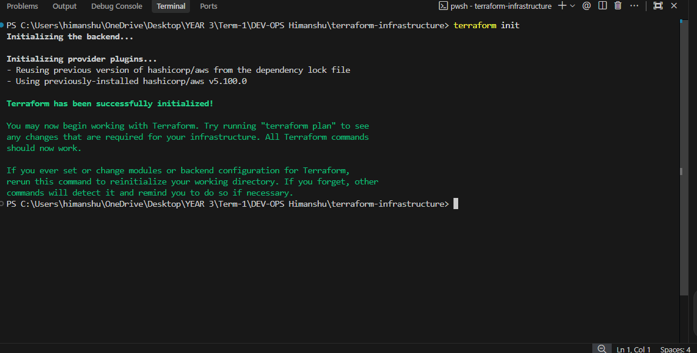
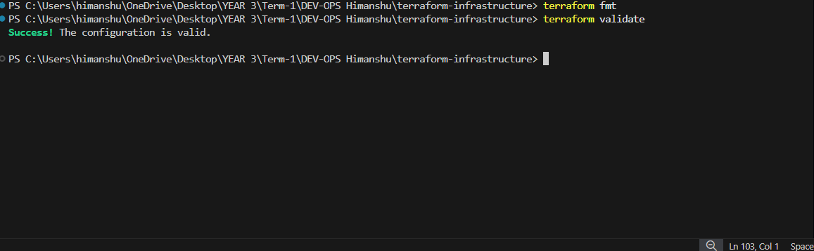
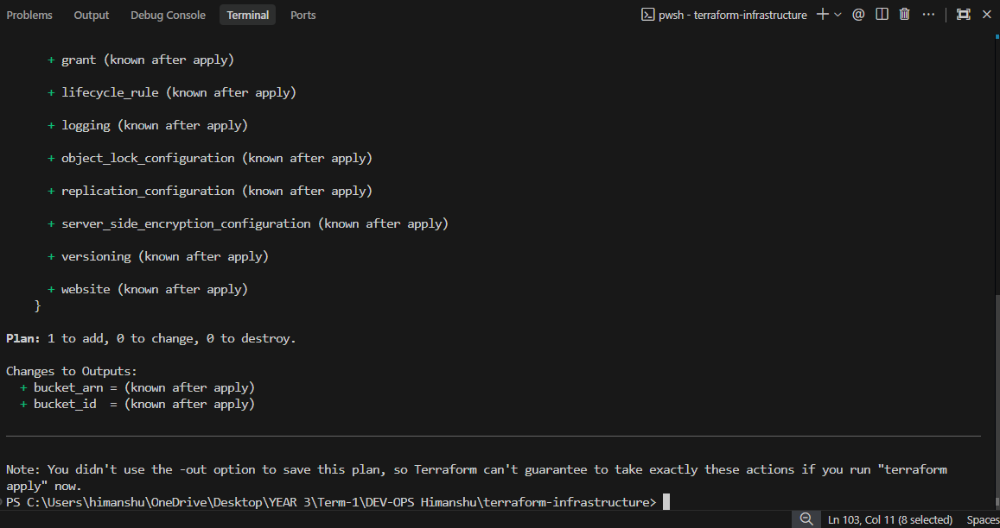
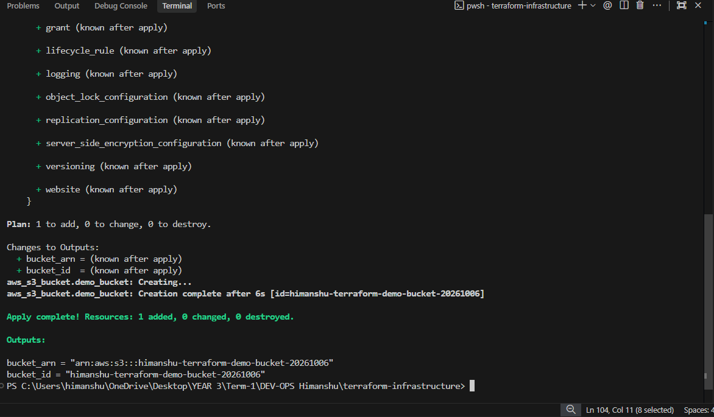
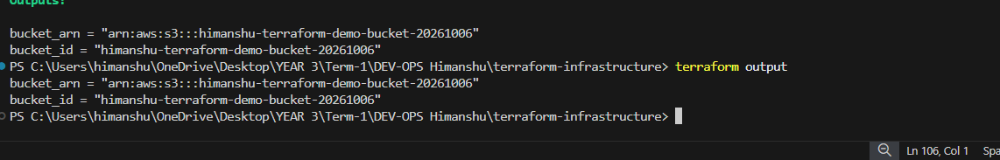
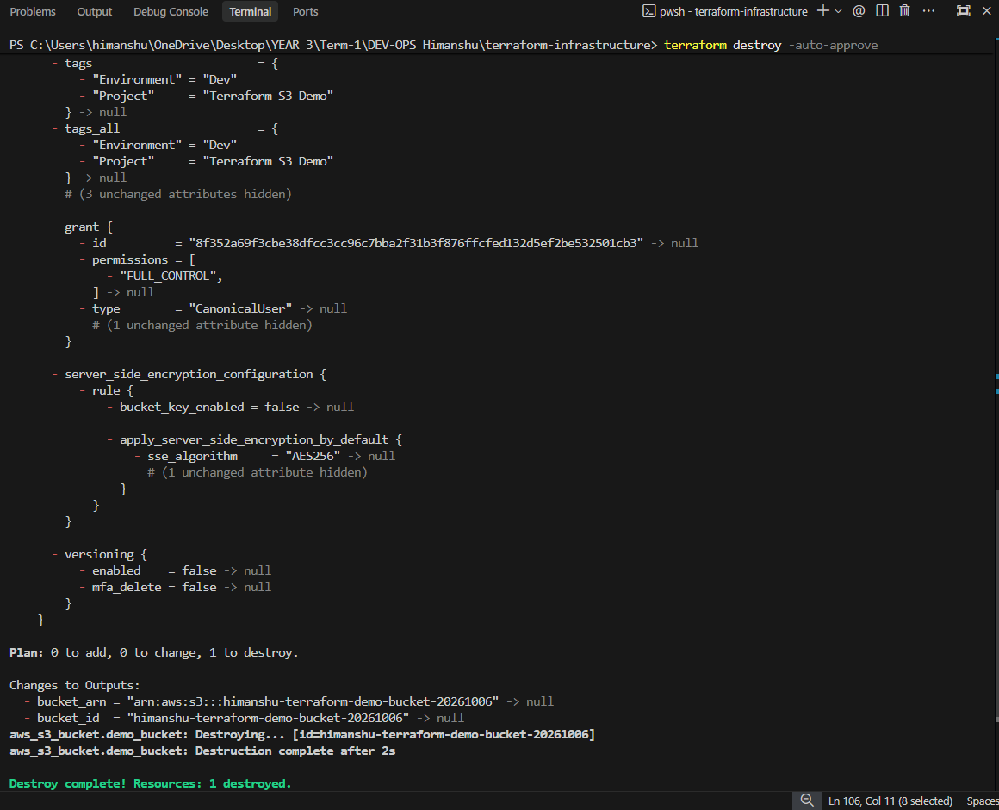

# AWS Services Research

## 01. IAM - Governance
* **What is IAM?** Identity and Access Management; a service that controls access to AWS resources.
* **Users:** Individual entities (people or applications) interacting with AWS.
* **Groups:** Collections of users that share the same permissions.
* **Roles:** Assumable identities with temporary credentials, typically used by services or cross-account users.
* **Policies:** JSON documents attached to identities or resources that explicitly define permissions.
* **Permissions:** Rules determining what actions are allowed or denied.
* **Least privilege:** The security principle of granting only the bare minimum permissions needed to perform a task.
* **IAM best practices:** Enable MFA, avoid using the root user, use roles instead of user credentials for applications, and regularly rotate keys.
* **Common use cases:** Providing secure access to AWS environments, enforcing security compliance, cross-account access.

## 02. EC2 - Compute
* **What is EC2?** Elastic Compute Cloud; provides scalable virtual servers in the cloud.
* **AMI:** Amazon Machine Image; a pre-configured template (OS and software) used to launch instances.
* **Instance types:** Different combinations of CPU, memory, storage, and networking capacity (e.g., t3.micro, m5.large).
* **Key pairs:** A set of public and private keys used for secure login (like SSH) into instances.
* **Security Groups:** Virtual, stateful firewalls that control inbound and outbound traffic at the instance level.
* **EBS:** Elastic Block Store; persistent, highly available block storage volumes attached to EC2 instances.
* **Public vs private IP:** Public IPs are routable over the internet; Private IPs are for internal AWS network communication.
* **Instance lifecycle:** The states an instance goes through (Pending -> Running -> Stopping -> Stopped -> Terminated).
* **Common use cases:** Web and application servers, batch processing, gaming servers.

## 03. S3 - Storage
* **What is S3?** Simple Storage Service; highly scalable and durable object storage.
* **Buckets:** Top-level logical containers for storing objects (names must be globally unique).
* **Objects:** The fundamental entities stored in S3 (files along with their metadata).
* **Storage classes:** Tiers based on access frequency and cost (e.g., Standard, Infrequent Access, Glacier).
* **Versioning:** A feature that keeps multiple variants of an object to protect against accidental deletion or overwrites.
* **Lifecycle policies:** Rules to automatically transition objects between storage classes or delete them over time.
* **Encryption:** Securing data at rest (via SSE-S3 or KMS) and in transit (via HTTPS).
* **Bucket policies:** Resource-based JSON policies attached directly to a bucket to control access.
* **Common use cases:** Data backups, static website hosting, media storage, data lakes.

## 04. VPC - Networking
* **What is VPC?** Virtual Private Cloud; a logically isolated virtual network defined by you within AWS.
* **CIDR:** Classless Inter-Domain Routing; a method for allocating IP addresses and defining the size of a network block.
* **Subnets:** Logical partitions of a VPC's IP address range to isolate resources.
* **Route tables:** Rules determining where network traffic from your subnet or gateway is directed.
* **Internet Gateway (IGW):** A component attached to a VPC that allows communication between resources and the internet.
* **NAT Gateway:** Allows instances in a private subnet to access the internet while preventing inbound internet connections.
* **Security Groups:** Stateful firewalls operating at the instance level.
* **Network ACLs:** Stateless firewalls operating at the subnet level.
* **Public vs private subnet:** A public subnet has a route to an IGW; a private subnet does not.

## 05. DynamoDB & RDS - Database Services

### DynamoDB
* **NoSQL:** A fully managed, serverless, non-relational database.
* **Tables:** Collections of data (similar to tables in SQL).
* **Items:** Individual records in a table (similar to rows).
* **Attributes:** Data elements attached to an item (similar to columns/fields).
* **Partition key:** The primary key attribute used to distribute data across storage partitions.
* **Sort key:** An optional secondary key used to sort items that share the same partition key.
* **Use cases:** High-scale web applications, gaming leaderboards, real-time bidding platforms, serverless applications.

### RDS
* **Relational database:** A managed SQL database service that handles administration tasks like patching and backups.
* **Supported engines:** MySQL, PostgreSQL, MariaDB, Oracle, SQL Server, and Amazon Aurora.
* **DB instances:** Isolated database environments running in the cloud.
* **Security:** Controlled via VPCs, Security Groups, IAM integration, and encryption at rest/transit.
* **Backups:** Automated daily backups and manual database snapshots.
* **Multi-AZ:** Synchronous data replication to a standby instance in another Availability Zone for high availability.
* **Read replicas:** Asynchronous replicas used to scale out read-heavy database workloads.
* **Use cases:** Traditional enterprise applications, ERP/CRM systems, e-commerce, complex transactional workloads.

---

# Terraform S3 Demo Workflow

This section documents the process of creating and managing an AWS S3 bucket using Terraform. The required configuration files (`provider.tf`, `variables.tf`, `main.tf`, `outputs.tf`, `terraform.tfvars`) have been placed directly in this folder.

## Executed Workflow

1. **`terraform init`**
   - **What it does:** Initializes the working directory, downloads the required AWS provider plugins, and sets up the backend.

2. **`terraform fmt`**
   - **What it does:** Automatically formats the Terraform configuration files to a canonical style for better readability and consistency.

3. **`terraform validate`**
   - **What it does:** Checks whether the configuration is syntactically valid and internally consistent, regardless of any provided variables or existing state.

4. **`terraform plan`**
   - **What it does:** Creates an execution plan, showing exactly what actions Terraform will take (e.g., creating the S3 bucket) without actually making any changes to AWS resources.

5. **`terraform apply`**
   - **What it does:** Executes the actions proposed in the Terraform plan to create the resources in your AWS account.

6. **`terraform show`**
   - **What it does:** Inspects the current state or a saved plan, providing a human-readable output of the resources that have been created.

7. **`terraform output`**
   - **What it does:** Extracts and displays the values of the output variables defined in `outputs.tf` (like the bucket name and ARN).

8. **`terraform destroy`**
   - **What it does:** Safely tears down and removes all the resources managed by this specific Terraform configuration from AWS.

